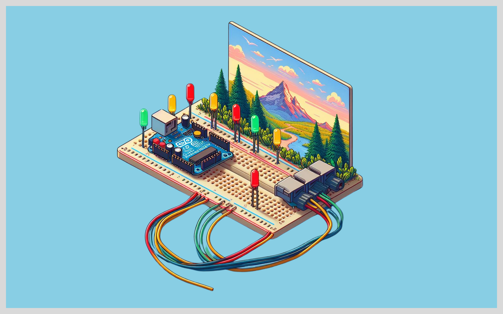

# AI COLOR AUTOLIGHT SYSTEM

## Repo Structure

```
    ├── docs                                   # Contains documents.
    ├── research                               # Contains pre-research experiments.
    │   ├── 0-code-references                      # Contains reference codes.
    │   ├── 1-keras-based-app                      # Contains keras-based app using Teachable Machine.
    ├── source                                 # Contains project source code.
    │   ├── main.py                                # HSV Color Detection-based app.
    └── README.MD                              # Readme Content.

```

## 01 Introduction

This is an automated lighting control system powered by Arduino and Computer Vision, utilizing AI technology for color detection to automate lighting operations. The system uses the HSV color detection algorithm and the Firmata protocol to enable Python to communicate with Arduino and turn on LEDs.



## 02 Technology Stack

### 2.1 Hardware Stack

- Arduino UNO
- LED: Red, Green, Blue
- Full Bread Board
- Jumper Wires

### 2.2 Software Stack

- Python 3.8.5 (Recommended)
- Arduino IDE (Framework)
- OpenCV
- PyFirmata

## 03 Setup

### 3.1 Hardware Setup


| LEDs          | Pin No  |
| ------------- | ------- |
| **RED LED**   | Pin: 13 |
| **Green LED** | Pin: 12 |
| **Blue LED**  | Pin: 11 |

### 3.2 Firmware Setup

Setting up the Arduino firmware is necessary to enable communication between Python and Arduino. The Firmata protocol establishes serial communication between a Python script and an Arduino.

To upload Firmata, open Arduino IDE and choose the correct COM port and **File -> Examples -> Firmata -> StandardFirmata -> Upload to Arduino UNO Board**.


**Note:** After uploading StandardFirmata to the Arduino Board, Python can be used to program it.

### 3.3 Setup Software

We will now install the necessary tools to gain access to the Arduino Board. This project utilizes essential libraries, including OpenCV and PyFirmata. We need to install all the required dependencies on the development computer.

- **Step 01:** Install Python

  ```
  Ver: 3.8.5 is Recommended (www.python.org)
  ```

- **Step 02:** Navigate to the specified location in CMD/Terminal.

  ```
  ai-color-autolight-system/docs/requirements.txt
  ```

- **Step 03:** Execute the given command to install all dependencies.

  ```
  pip install -r requirements.txt
  ```

## 04 Usage

- **Source Directory:**

  ```
  ai-color-autolight-system\source\main.py
  ```

### 4.1 Setps to run

- **Step 01:** Connect the Arduino to the development computer.

- **Step 02:** Modify the script to reflect the appropriate COM port.

  

- **Step 03:** Run app.

  ```
  python source/main.py
  ```

### 4.2 Output


# CONTACT

### Website: 

[](https://www.gunarakulan.info)

### Social Media:

[](https://www.linkedin.com/in/gunarakulangunaretnam)
[](https://www.facebook.com/gunarakulangunaretnam)
[](https://wa.me/94740001141?text=WhatsApp%3A%20%2B9740001141)
[](https://www.instagram.com/gunarakulangunaretnam)
[](https://x.com/gunarakulangr)
[](https://www.kaggle.com/gunarakulangr)
[](https://www.tiktok.com/@gunarakulangunaretnam)
[](https://www.youtube.com/channel/UCjMOdgHFAjAdBKiqV8y2Tww)
